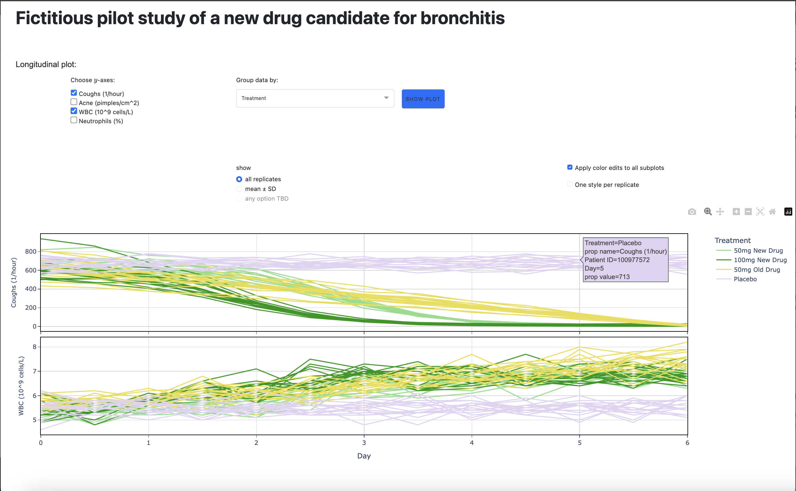
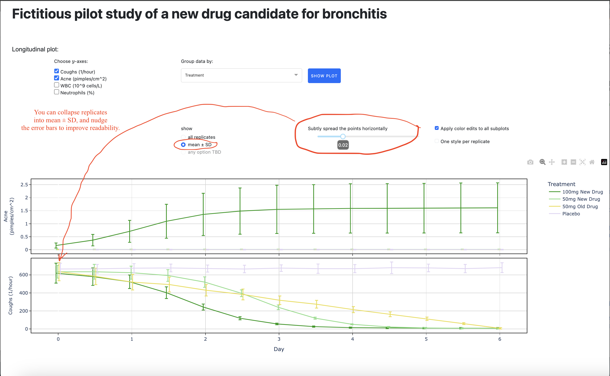
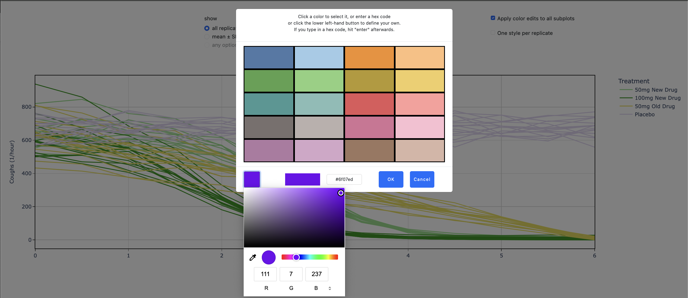
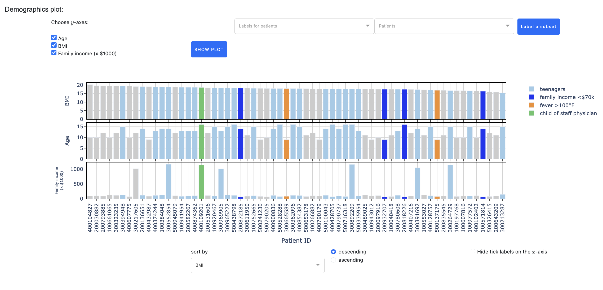
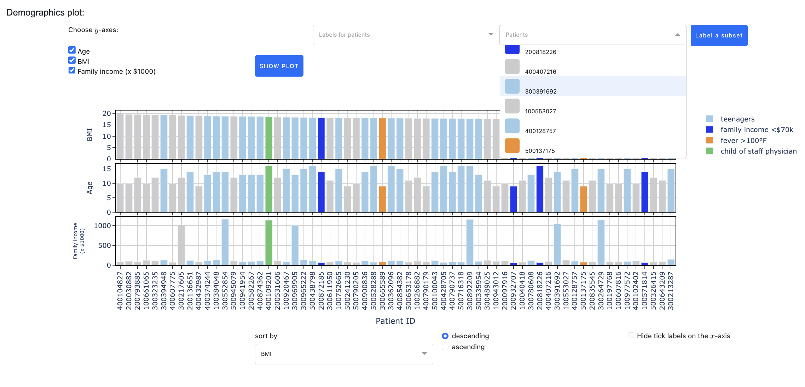
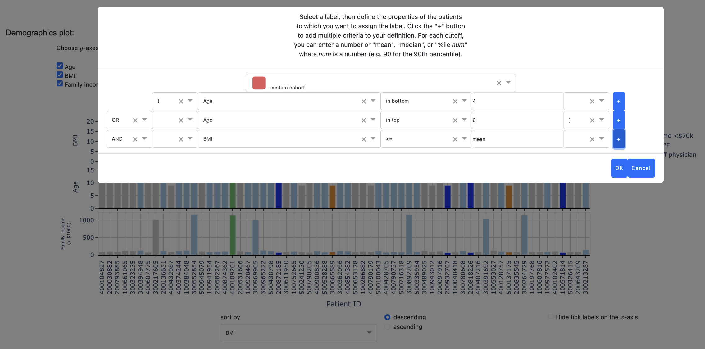
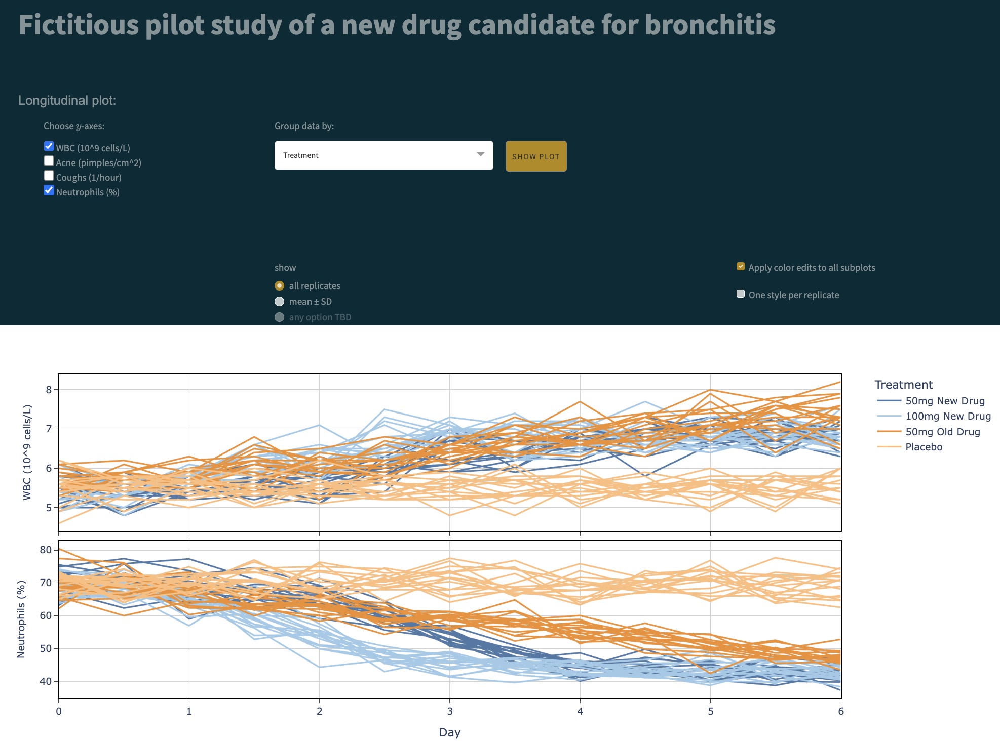

# Description

Plotting Partner is an interactive visualization app for data sets in which
properties varying over time (longitudinal data) were measured for collections
of samples, and bar plots of non-time-varying properties (sample demographics,
mean or max over time points, etc.) are desired in addition to plots of
property values vs. time. Although this app looks relatively simple,
it gives the user strong interactive control over the plots, enabling
user customizations that are not available in some commercial packages
(Tableau). User-designed plots can be downloaded from Plotting Partner
for use in reports and publications.

Demo data is provided for a fictitious pilot study of a new drug
for bronchitis in children. Here&rsquo;s a snapshot of some of the
longitudinal data:


All replicates per sample grouping are displayed individually be default.
You can instead show just the mean ± SD at each time point, and
interactively nudge these horizontally if there&rsquo;s a lot of overlap.
In the fictitious pilot study, it looks like the higher dose of the new
drug induces an unfortunate side-effect:


Click on any line to change its color via a custom &ldquo;color picker:&rdquo;


Here&rsquo;s a snapshot of the fictitious demographic data:


Within the dropdown list of samples (Patient IDs in this demo), you can
scroll to a desired entry or type the beginning of it into the box to search for it,
and then you can click on that entry to assign a label to it or to change its label:


You can also build up complex queries to apply a label to any desired subset:



Plotting Partner is a python program that makes extensive use
of Plotly Dash packages.

# Installation

Clone the repository:  
```bash
$ git clone https://github.com/erynes/plotting_partner.git

```

Run `pipenv install` to build the virtual environment.

Run `pipenv shell` to enter the venv.

# Usage

From the command line, from within the venv, run `python app.py`.
When an URL is displayed, copy and paste it into a browser window to run the app.
As you click around the app, more and more lines of output will appear in your
command line window. You can suppress these via a `debug` flag: `python app.py --debug`.

Two interactive (optionally multi-faceted) plots will be created: a line plot of measurements vs. time
(&ldquo;day&rdquo; on the x-axis), and a bar plot of metrics per sample (with &ldquo;sample,&rdquo;
&ldquo;Patient ID,&rdquo; or equivalent on the x-axis).

For each plot, you&rsquo;ll see a checklist populated with all of the properties you can view in that plot
(one facet (a.k.a. subplot) for each). Whenever you check or un-check properties, click &ldquo;SHOW PLOT&rdquo;
to render the corresponding plot. Note: The line plot will not initially appear until you select properties for it;
the bar plot will initially appear with all properties selected and plotted.

Plotting Partner uses Dash Bootstrap Components, with the &ldquo;Bootstrap&rdquo; theme by default.
You can switch to any of the other themes shown
<a href="https://dash-bootstrap-components.opensource.faculty.ai/docs/themes/explorer/" target="_blank">here</a>
by using the `--theme` parameter in your run command. Running `python app.py --theme solar`
will make the demo look like this:


## Line plot (time-varying measurements)

For the line plot, choose an entity by which to group (i.e. color) the data,
e.g. to highlight comparisons between molecules, passages, or plate IDs.  
Once you've chosen y-axis and "group by" properties and rendered a line plot via the "SHOW PLOT" button,
you can choose whether to collapse replicates (plot mean ± SD),
you can hide curves by clicking on their entries in the legend,
and you can change any curve's color by clicking on a data point within the curve.  
By default, changing one replicate's color will change its color in all subplots
and will also change the color of all fellow replicates of the same entity.
Options are provided (via checkboxes) to restrict changes to single subplots
and single replicates. See further below for a description of the color-choice options.  
If you choose to collapse replicates, a slider will appear to the right of your choice
enabling you to optionally "subtly spread the points horizontally."
This can be helpful to distinguish points ± error bars that lie on top of each other,
which commonly occurs because measurements are made at identical discrete values ("day" on the x-axis).

## Bar plot (demographics and/or summary metrics)

For the bar plot, the samples will be unlabeled at first
and their bars will appear in gray. Define labels via the first dropdown above the bar plot,
and assign them to samples via the second dropdown above it. Those samples will immediately
be labeled accordingly upon assignment of a label to a sample. You can click on any labeled
sample in the right dropdown to change its label, and you can click on any label (in the left
dropdown) to change the color or name of the label.

You can define any label to be the default label (click the appropriate button when creating
or editing it); all samples to which no label has been assigned will instantly receive the
default label. If you make most/all bars blue by default, and then change your mind
and want them to be green, simply edit that label and change its color. Once a label is
defined as the default, it cannot be "un-checked" to become "no longer the default;"
instead, define a different label to be the default.

You can use the &ldquo;Label a subset&rdquo; button to specify a subset of samples and
assign a label to them. You can use this to explore your data: specify &ldquo;yield&rdquo;
&ldquo;==&rdquo; &ldquo;median&rdquo; to quickly find the sample with the median yield if you
have &ldquo;yield&rdquo; data. You can also define complex subsets, e.g. &ldquo;yield&rdquo;
&ldquo;in top&rdquo; &ldquo;3&rdquo; &ldquo;OR&rdquo; &ldquo;(&rdquo; &ldquo;purity&rdquo;
&ldquo;&gt;&rdquo; &ldquo;95&rdquo; &ldquo;AND&rdquo; &ldquo;yield&rdquo; &ldquo;&gt;&rdquo;
&ldquo;%ile 90&rdquo; &ldquo;)&rdquo;.

## Choosing colors

For either plot, when you elect to assign a color, a window will appear
that will enable you to set the color three ways:  
1. by clicking on one of the 20 colors shown, taken from the &ldquo;Tableau 20&rdquo; set  
2. by clicking in the square in the lower left-hand corner, which will bring up a new window
in which you can specify any color you wish via your mouse or the RGB inputs shown  
3. by typing a hexadecimal color code in the input box at the bottom of the window
adjacent to the &ldquo;OK&rdquo; button (optionally preceded by &ldquo;#&rdquo;).

The color you choose will then be displayed to the left of the &ldquo;hexadecimal input&rdquo;
box, and the corresponding hexadecimal value will be written into this input box.
